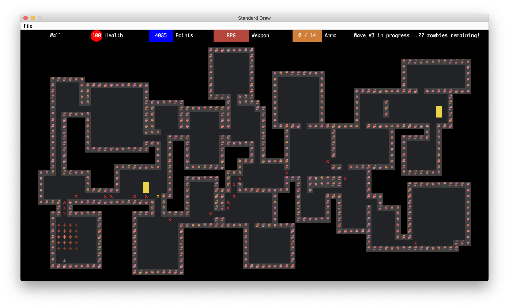

# Zombie Arena
A 2D zombie survival / shooting game build with Java.

### About
This project was originally a capstone project for one of my CS courses. We were asked to build a 2D game in Java, and the main requirement was that the world needs to be randomly generated (by a seed provided by the user). I took this project a lot further with my partner, and we ended up building a 2D zombie survival game.

Here are some important features of the game:
- The player initially has 100 health and 1000 points, and is spawned within a closed space consisting of rooms and hallways.
- The player starts with a pistol, but has access to “shops” inside the map to upgrade their weapons.
  - Random draw: get a random weapon
  - Buy specific weapon: there are a couple of weapons that can be directly bought
  - Different weapons have different effects (contact damage, explosive damage, penetration level, reload time, etc.)
- There are 15 waves of zombies. The health and number of zombies gradually increase with the wave number, which increases the difficulty of the game.
- After each wave the player has 60 moves to prepare himself for the next wave.
- We recorded a tutorial at https://www.youtube.com/watch?v=xsSVxd_UbP0.

